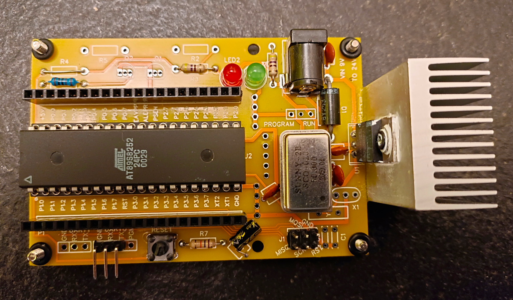
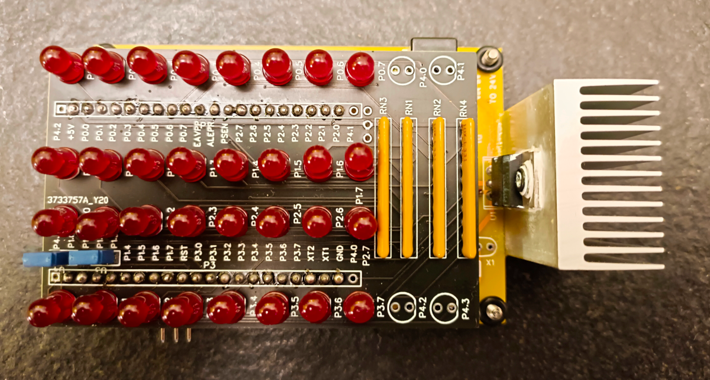

# 8052Explorer

## 8052 test board and software to gain experiences with the micro, for 89s8252, 89s8253, at89c52 and DS89C4x0

In the software there is a Visual Studio Code eide SDCC project with a sample firmware.

In the hardware dir the EasyEDA schematics for DIP and PLCC board, also a JOLLY board for both PLCC and DIP packages.

https://user-images.githubusercontent.com/2248402/200202080-bca16a68-9036-43b2-a727-592284dde87f.mp4

